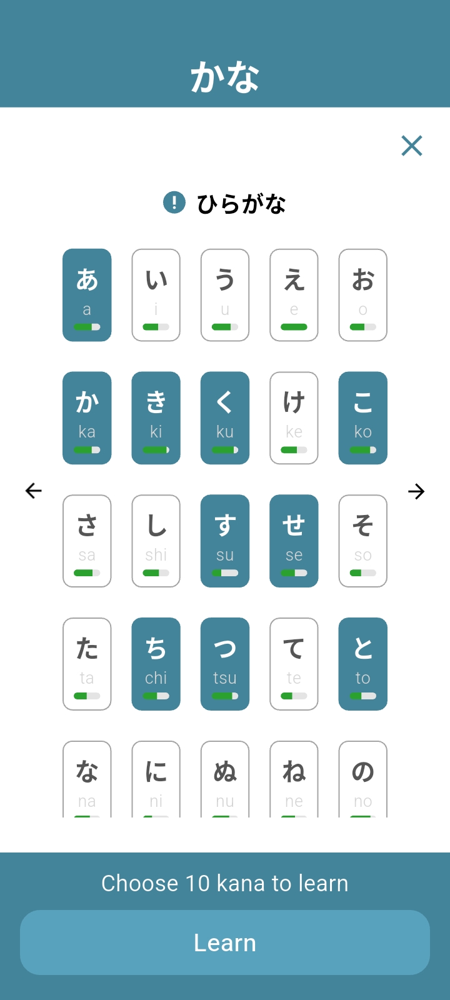
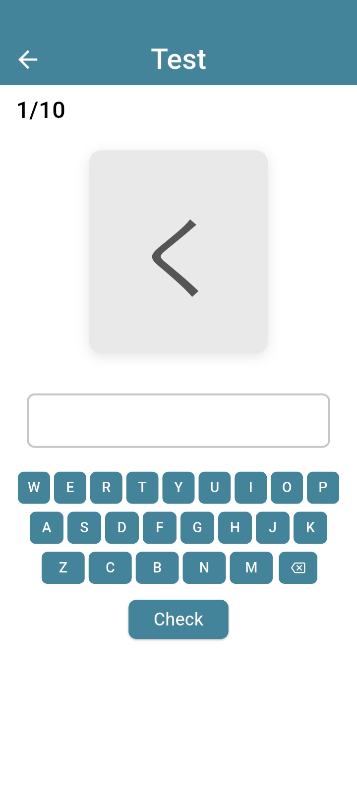
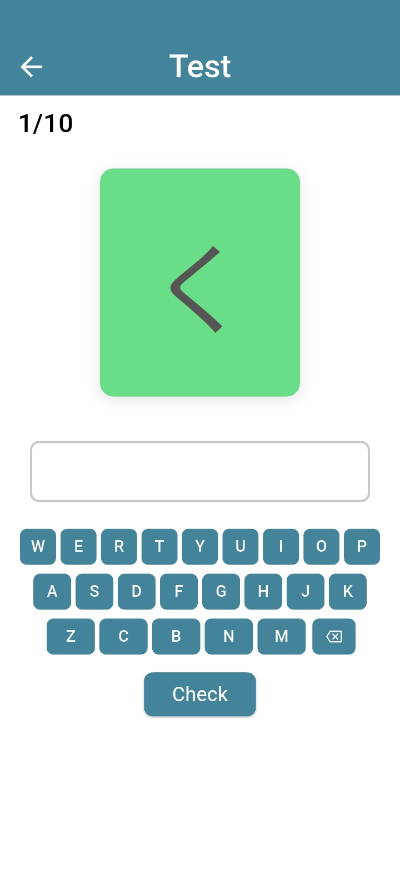
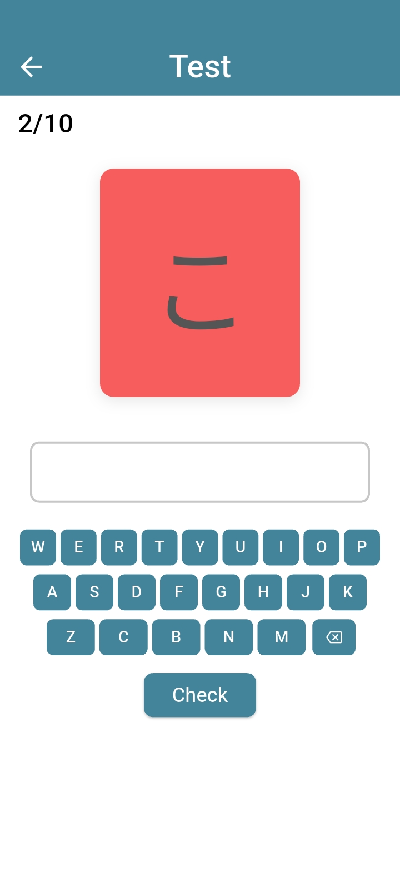
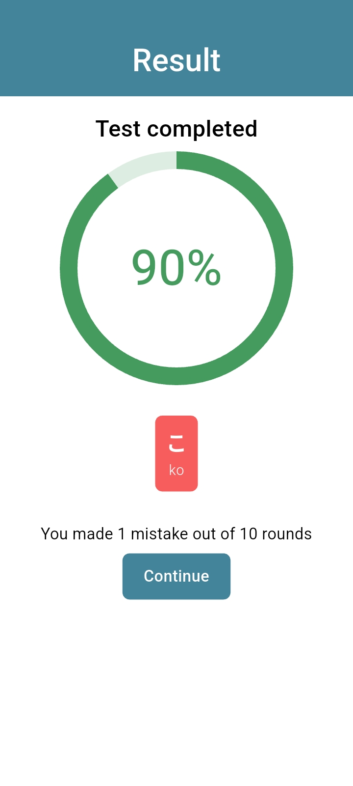

# **よみ Test (Yomi Test): Japanese reading learning app**

Practice learning to read Japanese characters and memorize them.
Covers **Hiragana** (beginner level), **Dakuon**, **Handakuon**, and **Yoon** combinations (characters combined with **"ya"**, **"yu"**, and **"yo"**).

## **About**

**よみ Test** is built with **Dart**, a programming language developed by Google for fast, cross-platform apps. The app is fully supported on Android devices and designed for offline learning.

## **Plans for Future Updates**

The app will be continuously improved with new lessons and features:

1. Add **Katakana** list
2. Add **Dakuon**, **Handakuon**, and **Yoon** for **Katakana**
3. Update UI for a more appealing look
4. Add completely new lessons like vocabulary (requires new testing method)
5. Implement new testing for sentence formation and grammar

## **App Features**

1. **Clean, intuitive interface:** Lesson lists are easy to navigate for seamless learning.
2. **Guided tutorial:** A short, beginner-friendly tutorial launches on first use to help users get started.
3. **Persistent progress tracking:** The app remembers user activity and progress across sessions.
4. **Comprehensive lesson explanations:** Covers Hiragana, Dakuon, Handakuon, and Yoon with clear, concise guidance.
5. **Customizable learning:** Users can select which kana to study and test their memory.
6. **Offline progress storage:** Progress is saved locally via SharedPreferences, allowing learning without an internet connection.
7. **Immediate visual feedback:** Correct and incorrect answers are highlighted during tests to reinforce learning.
8. **Result percentage:** Shows overall testing results and indicates which answers were incorrect.
9. **Dynamic localization:** The app detects the device’s system language and displays content accordingly, providing a seamless experience for users in different languages.

## **Screenshots**

  
  
  
  
  

## **App Workflow & Logic**

The app is designed to be intuitive and beginner-friendly, avoiding the complexity of other language learning apps. Unlike apps that overwhelm learners with Katakana and Kanji lessons from the start, **よみ Test** focuses on Hiragana first. To manage the learning curve, access to subsequent lessons is locked until users complete the entire Hiragana list, achieving **100%** progress before moving on to the next set of characters.

To implement this, I created a global file that receives progress data and checks which kana have reached **100%**. Each kana is then filtered by its corresponding list—Hiragana, Dakuon, Handakuon, or Yoon—to determine its category. Once all **100%** kanas are collected, the data is stored and sent to a function that blocks advancement to the next lesson until every kana in each list has reached **100%**.

The UI consists of three lesson lists, starting with the Hiragana list. Kanas are displayed in blocks of five per row, with some rows containing three or two blocks. Each block shows the Japanese character and its Romaji pronunciation, with a progress bar beneath indicating how many times the user has practiced that kana. Users can tap on blocks to select them. After selecting ten blocks, the **“Learn”** button is enabled, allowing the user to proceed to the test. Selections can be cleared by tapping the **“X”** button in the top-right corner. All selections and progress are stored in SharedPreferences, so data persists even if the app is closed and reopened.

The test page was designed to be simple, focusing on typing the correct answer and receiving immediate feedback. To achieve this, I implemented a display card that presents each kana from the selected set of ten in a random order. Below the card, an input field is displayed that accepts input only from custom input buttons, preventing the use of the system keyboard.

The input buttons include only Romaji (Japanese character pronunciation) letters, allowing users to tap characters to type their answer before pressing the **“Check”** button.

To determine whether the answer is correct, the app globally stores the input value and compares it with the corresponding kana data list. Based on whether a match is detected, a signal is sent to trigger visual feedback by displaying a green card for correct answers or a red card for incorrect ones.

All test results are saved globally and used to calculate an overall percentage score, which is displayed in a circular progress bar. Below this, the mistakes made by the user are listed; this section remains hidden if all answers are correct. To complete the full test, the user must finish ten rounds, with each round incremented after completion.

The round counter increases only after the correct or incorrect answer feedback has finished displaying. To ensure this, a short timer is implemented, allowing the feedback to remain visible for a few seconds before progressing. Once the timer expires, the next kana is displayed unless the current round is the tenth. After completing ten rounds, the app automatically navigates to the results page.

Users can exit the test at any time by pressing the back button in the top-left corner. All previously answered progress is saved as long as the user enters Romaji letters and presses the **“Check”** button.

By pressing the **“Continue”** button on the results page, the user is returned to the main page, where the Hiragana lesson list is displayed.
